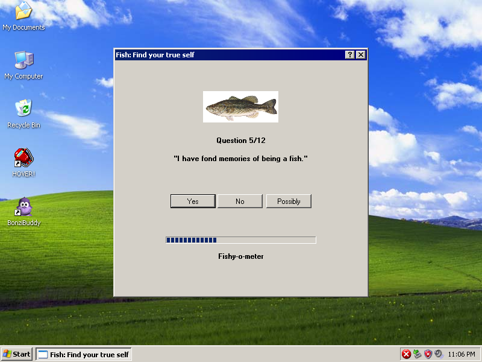

# Fish

Recreation of a [dream](https://www.reddit.com/r/thomastheplankengine/comments/11h4hmk/had_a_dream_this_window_popped_up_on_my_computer/).

Tested working on Windows XP and Windows 11.

## How to add more Fishy Questions

Edit the file "Fish\Resources\fishyQuestions.txt" to add your fishy questions, then build and enjoy!

## Building from source

Requires .NET Framework 3.5.

Open the provided solution file in Visual Studio 2022
